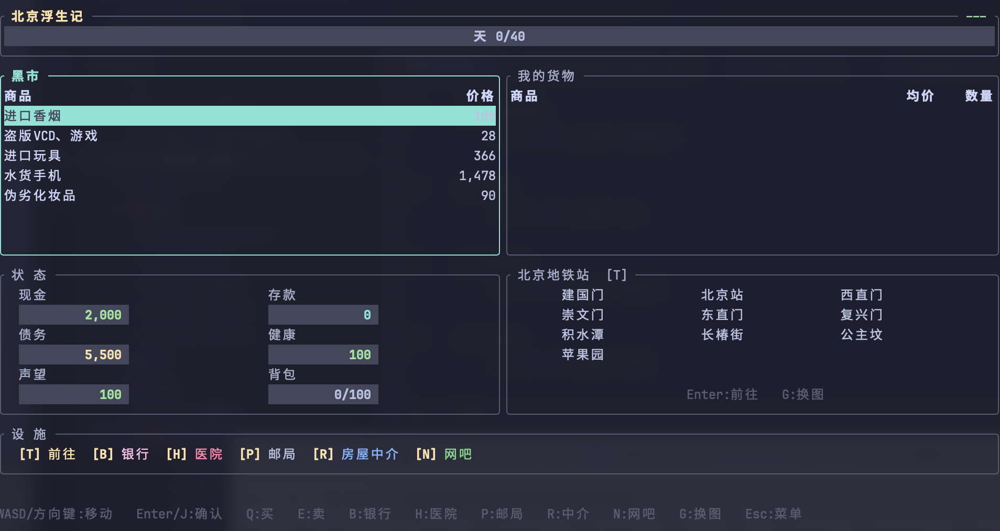
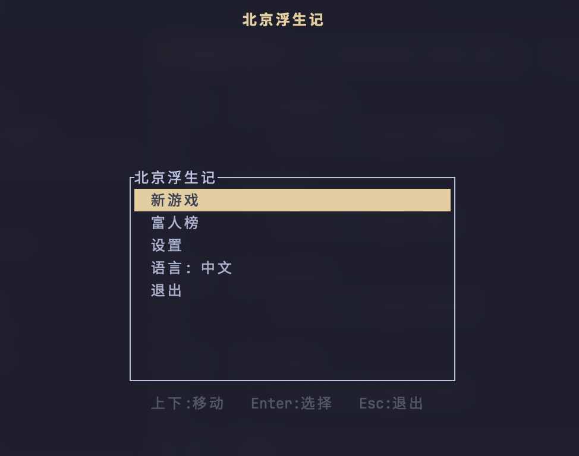
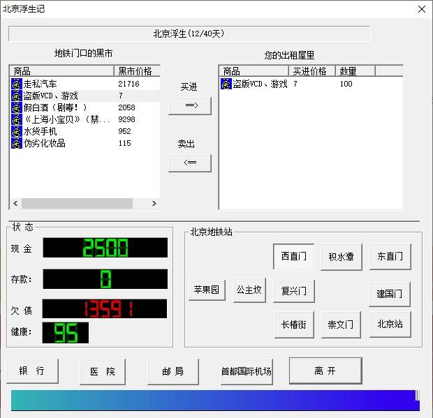

# Drifter - 北京浮生记

[English](README_EN.md)

经典怀旧游戏"北京浮生记"的终端版，用 Rust 重写。

在北京地铁沿线各站之间倒卖商品，应对随机事件，管理财务，在 40 天内尽可能多赚钱。





## 关于

本项目是 [北京浮生记 (Beijing Fushengji)](https://github.com/chrisguo/beijing_fushengji) 的终端版重新实现。原版由郭祥昊于 2002 年用 VC++ 6.0 编写，是中文版的 "Drug Wars" 类游戏。

<details>
<summary>原版 Windows 界面</summary>



</details>

我们逐行比对原版 C++ 源码，100% 还原了所有游戏机制，同时将界面现代化为终端 TUI。

## 特性

- **100% 还原原版逻辑** -- 18 条商业事件、12 条健康事件、7 条偷窃事件、利息计算、声望系统等，均对照原始 C++ 源码逐条验证
- **中英双语** -- 随时按 `L` 切换
- **现代 TUI** -- 天数进度条、价格涨跌颜色（绿涨红跌）、统一状态面板
- **跨平台** -- macOS (Intel + Apple Silicon)、Windows、Linux (x86_64 + aarch64)
- **单文件** -- 无依赖、无运行时、无需安装，直接运行
- **纯键盘操作** -- WASD / 方向键导航，面板间自然流转
- **MCP Server** -- 内置 [Model Context Protocol](https://modelcontextprotocol.io) 服务端，AI 大模型可直接操盘玩游戏或批量跑 benchmark

## 安装

### macOS (Homebrew)

```bash
brew tap vraxel/tap
brew install drifter
drifter
```

### Windows (Scoop)

```powershell
scoop bucket add vraxel https://github.com/vraxel/scoop-bucket
scoop install drifter
drifter
```

### 下载二进制

也可以从 [Releases](../../releases) 直接下载：

| 平台 | 文件 |
|---|---|
| macOS (通用) | `drifter-macos-universal.tar.gz` |
| macOS (Intel) | `drifter-macos-x86_64.tar.gz` |
| macOS (Apple Silicon) | `drifter-macos-aarch64.tar.gz` |
| Linux (x86_64) | `drifter-linux-x86_64.tar.gz` |
| Linux (aarch64) | `drifter-linux-aarch64.tar.gz` |
| Windows (64 位) | `drifter-windows-x86_64.zip` |

### 源码编译

```bash
git clone https://github.com/vraxel/drifter.git
cd drifter
cargo run --release
```

## 操作

| 按键 | 功能 |
|---|---|
| WASD / 方向键 | 导航移动 |
| Enter / J | 确认 / 买入 / 卖出 / 前往 |
| Esc / K | 取消 / 返回 |
| Q | 买入商品 |
| E | 卖出商品 |
| B / H / P / R / N | 银行 / 医院 / 邮局 / 房屋中介 / 网吧 |
| G | 切换地铁/地面地图 |
| L | 切换中英文 |
| O | 设置 |
| Tab | 循环切换面板 |

## 游戏规则

你是一个来北京闯荡的村民，身上有 **2,000 元**现金和 **5,000 元**债务（每天 10% 利息）。你有 **40 天**时间，在 10 个地点之间倒卖 8 种商品，应对市场波动、街头混混和各种意外。

**目标**：在第 40 天结束时，使 `现金 + 存款 - 债务` 最大化。

**设施**：银行（存款每天 1% 利息）、医院（每点 3,500 元）、房屋中介（扩大背包容量）、邮局（还债）、网吧（赚取小额收入）。

## AI 对战 (MCP)

Drifter 内置 MCP (Model Context Protocol) 服务端，任何支持 MCP 的 AI 客户端都可以用工具调用的方式操盘玩游戏。支持两种模式：

- **交互模式** -- AI 逐回合做决策（买卖、还债、前往地点），完整玩一局 40 天游戏
- **Benchmark 模式** -- 内置贪心策略批量跑 N 局，输出统计报告（最高/最低/平均分、胜率、分数分布）

同一个种子下不同模型跑出不同分数，可量化对比 AI 决策能力。

### 可用工具

| 工具 | 说明 |
|---|---|
| `new_game` | 开始新游戏（可指定 seed 和语言） |
| `get_state` | 获取当前状态 |
| `travel` | 前往地点（主回合动作，触发新一天） |
| `buy` / `sell` | 买入 / 卖出商品 |
| `bank_deposit` / `bank_withdraw` | 银行存取款 |
| `repay_debt` | 还债 |
| `visit_hospital` | 医院治疗 |
| `rent_house` | 租房扩容 |
| `visit_cafe` | 网吧 |
| `benchmark` | 批量跑 N 局并返回统计 |

### 配置方式

先确保 `drifter` 在 PATH 中（通过 Homebrew/Scoop 安装或手动放入），然后按你使用的客户端配置：

<details>
<summary><b>Claude Code (CLI / IDE 扩展)</b></summary>

```bash
claude mcp add drifter -- drifter mcp
```

或手动编辑 `~/.claude.json`：

```json
{
  "mcpServers": {
    "drifter": {
      "command": "drifter",
      "args": ["mcp"]
    }
  }
}
```

配置后可直接对话："帮我玩一局北京浮生记" 或 "benchmark 1000 局"。

项目自带 Claude Code Skill（`.claude/skills/play-drifter.md`），在 drifter 目录下可用 `/play-drifter` 或 `/play-drifter 1000` 快捷调用。

</details>

<details>
<summary><b>Claude Desktop</b></summary>

编辑配置文件：

- macOS: `~/Library/Application Support/Claude/claude_desktop_config.json`
- Windows: `%APPDATA%\Claude\claude_desktop_config.json`

```json
{
  "mcpServers": {
    "drifter": {
      "command": "drifter",
      "args": ["mcp"]
    }
  }
}
```

重启 Claude Desktop，对话中即可使用 drifter 工具。

</details>

<details>
<summary><b>Cursor</b></summary>

打开 Cursor Settings -> MCP，点击 "Add new MCP server"：

```json
{
  "mcpServers": {
    "drifter": {
      "command": "drifter",
      "args": ["mcp"]
    }
  }
}
```

或编辑项目根目录 `.cursor/mcp.json`：

```json
{
  "mcpServers": {
    "drifter": {
      "command": "drifter",
      "args": ["mcp"]
    }
  }
}
```

</details>

<details>
<summary><b>Windsurf</b></summary>

编辑 `~/.codeium/windsurf/mcp_config.json`：

```json
{
  "mcpServers": {
    "drifter": {
      "command": "drifter",
      "args": ["mcp"]
    }
  }
}
```

</details>

<details>
<summary><b>VS Code (GitHub Copilot)</b></summary>

在项目根目录创建 `.vscode/mcp.json`：

```json
{
  "servers": {
    "drifter": {
      "type": "stdio",
      "command": "drifter",
      "args": ["mcp"]
    }
  }
}
```

在 Copilot Chat 中使用 Agent 模式即可调用。

</details>

<details>
<summary><b>其他 MCP 客户端</b></summary>

Drifter MCP 使用标准 stdio 传输协议。任何兼容 [MCP 规范](https://modelcontextprotocol.io) 的客户端均可接入：

```
命令: drifter mcp
传输: stdio
协议: JSON-RPC 2.0
```

启动后发送 `initialize` 握手，然后通过 `tools/list` 获取工具列表，`tools/call` 调用工具。

</details>

## 技术栈

- [Rust](https://www.rust-lang.org/)
- [ratatui](https://github.com/ratatui/ratatui) -- TUI 框架
- [crossterm](https://github.com/crossterm-rs/crossterm) -- 跨平台终端后端
- [unicode-width](https://github.com/unicode-rs/unicode-width) -- CJK 字符宽度处理

## 致谢

- 原版游戏：[chrisguo/beijing_fushengji](https://github.com/chrisguo/beijing_fushengji)，郭祥昊作品 (GPL-2.0)
- 游戏概念源自 "Drug Wars" / "Dope Wars"

## 许可证

GPL-2.0（与原版一致）
